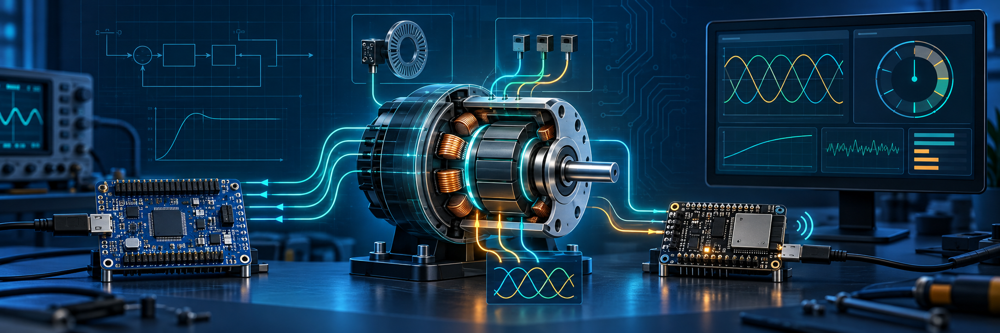
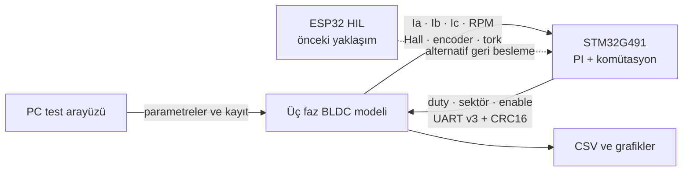
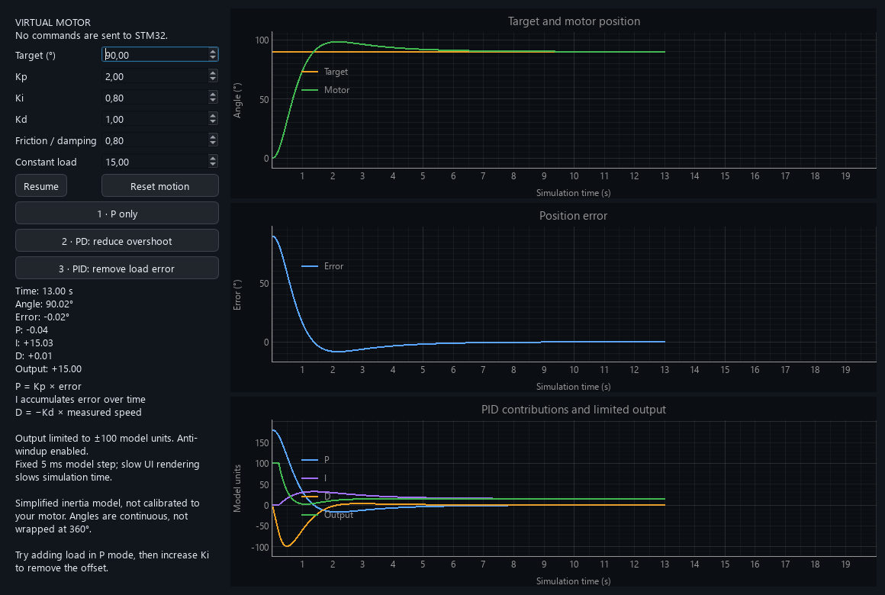
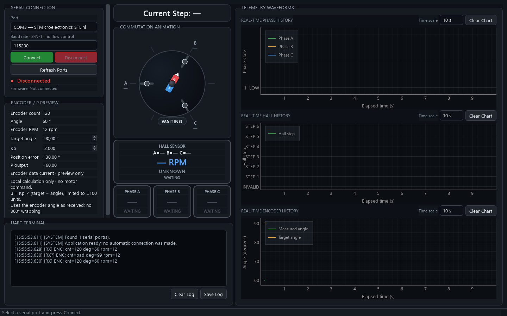

<p align="center">
  
</p>

<h1 align="center">Gömülü Sistemler Staj Portföyü</h1>

<p align="center">
  <strong>STM32 · ESP32 · BLDC Motor Kontrolü · HIL Simülasyonu · UART · Masaüstü Arayüzleri</strong>
</p>

<p align="center">
  Gerçek motora geçmeden önce kontrol yazılımını ölçülebilir, tekrarlanabilir ve güvenli biçimde doğrulamaya odaklanan bir staj çalışmaları koleksiyonu.
</p>

---

## Genel bakış

Bu depo, staj boyunca geliştirilen gömülü sistem ve test araçlarını tek bir teknik portföy altında toplar. Çalışma; kamera SDK'sı ile masaüstü test arayüzünden başlayıp Hall sensörü izlemeye, ESP32 tabanlı sanal akım geri beslemesine ve sonunda STM32 üzerindeki PI akım kontrolcüsünün PC'de çalışan üç fazlı BLDC modeliyle sınandığı bir Hardware-in-the-Loop (HIL) mimarisine ilerledi.

Ana hedef şudur:

> Güç katını ve gerçek motoru devreye almadan önce kontrol algoritmasını, haberleşme protokolünü, hata senaryolarını ve sanal sensör geri beslemesini doğrulamak.

## Öne çıkan sonuçlar

- STM32 NUCLEO-G491RE için Hall/encoder ve PI akım kontrolü çalışmaları
- ESP32 üzerinde 1 kHz sanal yük ve UART tabanlı HIL prototipi
- PC üzerinde yıldız bağlı, trapez geri EMK'li üç faz BLDC motor modeli
- CRC16, session ve sequence denetimli deterministik UART v3 protokolü
- Hall, encoder, faz akımları, RPM ve tork üreten sanal sensör katmanı
- Python/PyQt6 ve C#/.NET ile canlı telemetri ve test arayüzleri
- PC motor modeli için **23 otomatik test — tamamı başarılı**
- ESP32 HIL uygulaması için kart üzerinde **26 test — tamamı başarılı**

## Sistem mimarisi



PC modeli ile STM32 lockstep ilerler: STM32 bir komut yollar, PC tam 1 ms sanal zaman hesaplar ve geri besleme döndürür. Bilgisayarın anlık gecikmeleri modelin zaman adımını değiştirmez.

Ayrıntılı açıklama için [mimari belgesine](docs/ARCHITECTURE.md), gelişimin tamamı için [çalışma geçmişine](docs/WORKLOG.md) bakabilirsiniz.

## Projeler

| Proje | Teknoloji | Amaç | Durum |
|---|---|---|---|
| [PC BLDC Simülatörü](projects/bldc-pc-simulator/) | Python, Tkinter, NumPy/Matplotlib | Üç faz motor, mekanik sistem ve sanal sensör modeli | 23 test geçti |
| [STM32–PC HIL Firmware](projects/stm32-pc-hil/) | C, STM32 HAL, CubeIDE | PI kontrolünü PC modeliyle kapalı çevrim çalıştırmak | Yazılım hazır; fiziksel UART testi sırada |
| [ESP32 BLDC HIL](projects/esp32-bldc-hil/) | C, ESP-IDF, FreeRTOS | İlk sanal akım geri besleme yaklaşımı | Kartta 26 test geçti |
| [BLDC Hall İzleyici](projects/bldc-hall-monitor/) | C, C#, WinForms | Hall sektörlerini kartta üretmek ve masaüstünde izlemek | Firmware ve arayüz derlendi |
| [Motor Kontrol Monitörü](projects/motor-control-monitor/) | Python, PyQt6 | Faz, Hall, encoder ve PI telemetrisini görselleştirmek | Demo ve protokol katmanı hazır |
| [Imperx Kamera Test Aracı](projects/imperx-camera-tester/) | C#, .NET Framework | Kamera bağlantısı, ROI/crop ve kare akışı testi | Demo ve SDK modu hazır |

## Gelişim yolu

```text
Kamera test aracı
      ↓
STM32 Hall sektör üretimi ve Windows izleyici
      ↓
ESP32 ile sanal akım geri beslemesi
      ↓
PC üzerinde üç faz BLDC + mekanik model
      ↓
STM32 PI ↔ PC motor modeli kapalı çevrim HIL
```

Bu sıra yalnız sonuçları değil, mühendislik kararlarının neden değiştiğini de gösterir. ESP32 çözümü başarılı bir ara adımdı; ancak gerçek motor hiç dönmeden Hall ve encoder geri beslemesi de üretme gereksinimi ortaya çıkınca daha ayrıntılı PC modeline geçildi.

## Teknik kapsam

### Gömülü yazılım

- STM32G491 ve ESP32 hedefleri
- Timer, GPIO, UART ve encoder çevre birimleri
- FreeRTOS görevleri ve ISR–task ayrımı
- Altı adımlı BLDC komütasyonu
- PI akım kontrolü, doyum ve anti-windup
- Timeout, CRC, tekrar paket ve sıra kaybı yönetimi

### Modelleme ve HIL

- Ayrı A/B/C faz akımları ve yıldız noktası kısıtı
- Trapez geri elektromotor kuvveti
- Elektromanyetik tork, atalet, sürtünme ve yük
- Ortalama ve anahtarlamalı PWM seçenekleri
- Rotor açısından Hall dizisi ve encoder üretimi
- Sabit 1 ms sanal zaman adımlı lockstep protokol

### Masaüstü araçları

- Seri portların arayüzü kilitlemeden ayrı iş parçacığında izlenmesi
- Canlı grafikler, hata sayaçları ve terminal görünümü
- JSON parametre kaydı ve CSV sonuç dışa aktarımı
- Donanım olmadan kullanılabilen demo modları

## UART v3 özeti

| Yön | Mesaj | Boyut | İçerik |
|---|---|---:|---|
| STM32 → PC | Komut `0x10` | 30 bayt | sequence, session, duty, sektör, enable, PWM modu, hedef akım |
| PC → STM32 | Feedback `0x11` | 68 bayt | üç faz akımı, ölçülen akım, RPM, encoder, tork, Hall ve hata sayaçları |

Çok baytlı alanlar little-endian'dır. Çerçeveler CRC-16/CCITT-FALSE ile korunur. Ayrıntılı alan tablosu [protokol belgesinde](projects/bldc-pc-simulator/PROTOCOL.md) bulunur.

## Hızlı başlangıç

### PC motor simülatörü

Windows'ta:

```powershell
cd projects/bldc-pc-simulator
py -m venv .venv
.\.venv\Scripts\Activate.ps1
pip install -r requirements.txt
python run_simulator.py
```

Kart olmadan arayüzü ve motor modelini görmek için **PC Demo** modu kullanılabilir. Otomatik testleri çalıştırmak için:

```powershell
python -m unittest discover -s tests -v
```

### ESP32 HIL

ESP-IDF ortamında:

```powershell
cd projects/esp32-bldc-hil
idf.py build
idf.py flash monitor
```

### STM32 firmware

`projects/stm32-pc-hil/Real_motor_read_hall.ioc` dosyasını STM32CubeMX/CubeIDE ile açın. PC simülasyon modu ve fiziksel sensör modu ilgili proje README'lerinde açıklanmıştır.

> Donanım bağlantısı yapmadan önce kartların ortak GND kullandığını ve tüm lojik seviyelerin 3,3 V ile uyumlu olduğunu doğrulayın. Motor fazları hiçbir zaman MCU GPIO pinlerine doğrudan bağlanmamalıdır.

## Görsel arayüzler

### Motor kontrol monitörü

<p align="center">
  
  
</p>

Arayüz; hedef/sanal akım, PWM, Hall sektörü, encoder konumu ve seri telemetriyi ayrı panellerde izlemek için geliştirildi.

## Doğrulama durumu

| Katman | Doğrulanan | Açık kalan |
|---|---|---|
| PC motor modeli | Fizik denklemleri, Hall/encoder, CRC, parser, sequence, kapalı çevrim yazılım testi | Gerçek motor parametreleriyle kalibrasyon |
| ESP32 HIL | Derleme, kart üzerinde 26 Unity testi, kararlı açılış | Güncel PC mimarisinde kullanılmıyor |
| STM32 | PI ve PC bağlantı kodu, ARM derleme çıktısı | Gerçek kart ↔ PC 4 Mbaud UART kapalı çevrim deneyi |
| Masaüstü arayüzleri | Demo akışları, ayrıştırıcılar, görsel kontroller | Uzun süreli donanım bağlantı testi |

Sıradaki kritik deney rotor kilitli halde `0 A → 3 A` referans adımıdır. Ölçülecek temel metrikler yükselme süresi, aşım, yerleşme süresi, kalıcı hata ve duty doyumudur. Güncel yol haritası [ROADMAP.md](docs/ROADMAP.md) dosyasındadır.

## Depo yapısı

```text
.
├── docs/
│   ├── assets/                 # README görselleri
│   ├── ARCHITECTURE.md         # HIL mimarisi ve tasarım kararları
│   ├── ROADMAP.md              # Son iki hafta için hedefler
│   └── WORKLOG.md              # Ayrıntılı teknik çalışma geçmişi
├── projects/
│   ├── bldc-hall-monitor/      # STM32 + C# Hall test sistemi
│   ├── bldc-pc-simulator/      # Üç faz BLDC PC modeli
│   ├── esp32-bldc-hil/         # ESP32 tabanlı ilk HIL yaklaşımı
│   ├── imperx-camera-tester/   # Kamera SDK test arayüzü
│   ├── motor-control-monitor/  # PyQt6 telemetri arayüzü
│   └── stm32-pc-hil/           # Güncel STM32 PI/HIL firmware'i
├── .gitignore
└── README.md
```

## Notlar ve sınırlar

- Simülasyon; kontrol mantığı, haberleşme ve hata yönetimi için güçlü kanıt sağlar, fakat gerçek güç katı kabul testinin yerine geçmez.
- Dead-time, MOSFET anahtarlaması, ADC gürültüsü, EMI, termal davranış ve motor doygunluğu fiziksel düzende ayrıca doğrulanmalıdır.
- Varsayılan motor parametreleri örnektir; gerçek motorun R, L, Ke, kutup çifti, atalet ve yük değerleriyle kalibre edilmelidir.
- Şirket içi olabilecek belgeler, kişisel staj defterleri, SDK paketleri, kart yedekleri ve derleme çıktıları depoya dahil edilmemiştir.

## Hazırlayan

**Taha Güneş** — Gömülü sistemler staj çalışmaları, 2026

