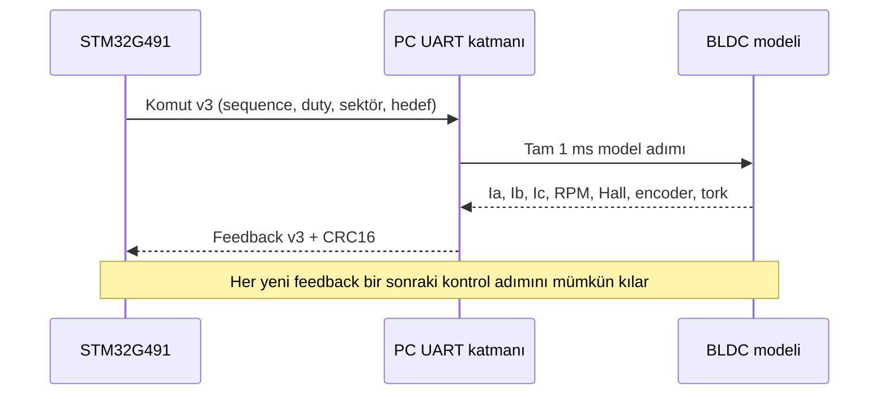

# HIL mimarisi

## Amaç

STM32 üzerinde çalışan PI akım kontrolcüsünü gerçek motor ve güç katı olmadan, PC üzerinde çalışan sanal üç fazlı BLDC motora karşı sınamak.

## Güncel veri akışı

## Neden lockstep?

Windows ve USB-UART hattı kesin 1 ms gerçek zaman garantisi vermez. Model duvar saatine bağlansaydı bilgisayar yükü değiştikçe fizik denklemlerinin zaman adımı da değişirdi. Lockstep tasarımında her geçerli komut yalnız bir model adımı ilerletir; böylece simülasyon yavaşlayabilir fakat sayısal zamanı bozulmaz.

## Motor modelinin bileşenleri

1. Üç faz için ayrı R-L diferansiyel denklemleri
2. Yıldız noktası ve `ia + ib + ic = 0` koşulu
3. Rotor açısına bağlı trapez geri EMK
4. Altı adımlı inverter terminal durumları
5. Elektriksel güçten elektromanyetik tork
6. Atalet, viskoz sürtünme ve harici yük
7. Rotor açısından Hall sektörü ve encoder sayımı
8. Filtreli akım ölçümü ve aşırı akım koruması

## İki HIL yaklaşımı

| Yaklaşım | Geri besleme | Güçlü yanı | Neden değişti? |
|---|---|---|---|
| ESP32 HIL | Basitleştirilmiş sanal akım | Gerçek zamanlı kart yürütmesi ve fiziksel UART | Gerçek Hall/RPM bekliyordu; motor tamamen sanal değildi |
| PC HIL | Üç faz akımı, Hall, encoder, RPM ve tork | Ayrıntılı model, grafik, parametre değişimi, CSV | Güncel ana çözüm |

İki yaklaşım aynı deneyde birlikte kullanılmaz; bunlar farklı doğrulama katmanlarıdır.

## Güvenlik davranışı

- Bozuk CRC veya eksik çerçeve modeli ilerletmez.
- Aynı sequence ve aynı içerik tekrar gelirse önceki cevap döner; fizik ikinci kez ilerlemez.
- Aynı sequence ile farklı içerik reddedilir.
- Yeni komut gelmezse timeout durumuna geçilir ve sürme güvenli biçimde durdurulur.
- Yeni PC bağlantısı farklı session kimliği üretir; STM32 integral ve sıra durumunu sıfırlar.

